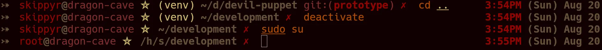

# Devil Puppet
## About
This repository contains the source code of Devil Puppet, a custom theme for
the ZSH shell that is decorated by a pentagram, that was designed for people
to look cool and evil.

Here is a preview that you can check out:



Please note that the colors used in the theme may look different in your setup,
as they depend on your terminal emulator's theme. The theme used in the preview
is [Hell Eyes](https://github.com/skippyr/hell-eyes).

In the left prompt, you will find:
- Your host and user names.
- If you have sourced a virtual environment, its base name.
- Your current directory path, abbreviating parent directories by their
  initials.
- If inside a Git repository, the active branch name.
- The exit code of failed commands.

In the right prompt, you will find:
- A clock: displaying the current hour and minute using the 12 hours (AM/PM)
  format.
- A calendar: displaying the day of the week, month and day of the month.

## Installation
### Dependencies
In order to install and run this software properly, the following dependencies
must be installed:

- `zsh`: this is the shell this theme applies on.
- `git`: required to both clone this repository and get information about your
         Git repositories to show in the prompt.
- A [Nerd Fonts' font](https://www.nerdfonts.com/font-downloads):
  required to provide the pretty symbols used in the prompt.

### Procedures
Using a command-line utility, follow these steps to install this software:

- Clone this repository using `git`.

  ```bash
  git clone --depth 1 https://github.com/skippyr/devil-puppet                  \
                      ~/.local/share/zsh/themes/devil-puppet
  ```

  The option `depth` with value `1` specifies to `git` that you only want to
  download the latest commit instead of the whole commit that it would do by
  default.

- Add the following source rule to your `~/.zshrc` file. Ensure to not be
  sourcing any other theme to avoid conflicts.

  ```bash
  source ~/.local/share/zsh/themes/devil-puppet/devil-puppet.zsh-theme
  ```

- Open a new ZSH session. At this point, the theme should be running and be
  ready for you to use.

## Support
Report issues, questions and suggestions through its [issue page](https://github.com/skippyr/devil-puppet/issues).

## Copyright
This software is under the BSD-3-Clause license. A copy of the license is
bundled with the source code.
